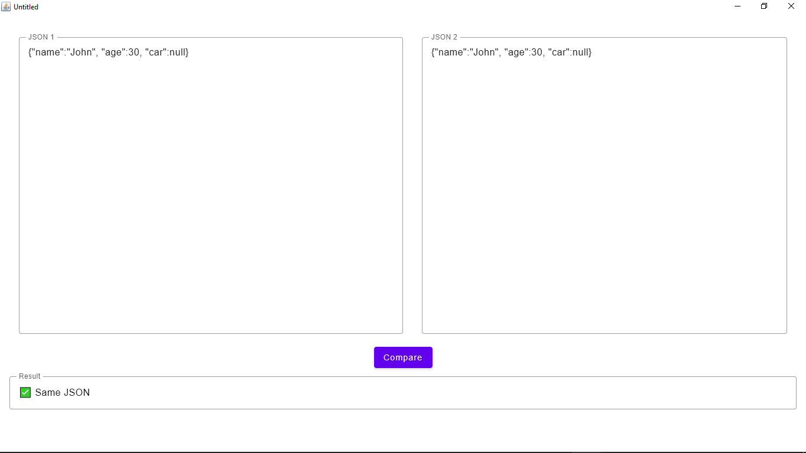

# JSON Comparator Tool

A desktop application build using Compose Multiplatform and Kotlin to compare the two JSON codes. The main aim of building the application was to get introduced to desktop application.

# Tech Stack
-[Compose Multiplatform] - A declarative framework for sharing UIs across multiple platforms. Based on Kotlin and Jetpack Compose.

# Screenshots

